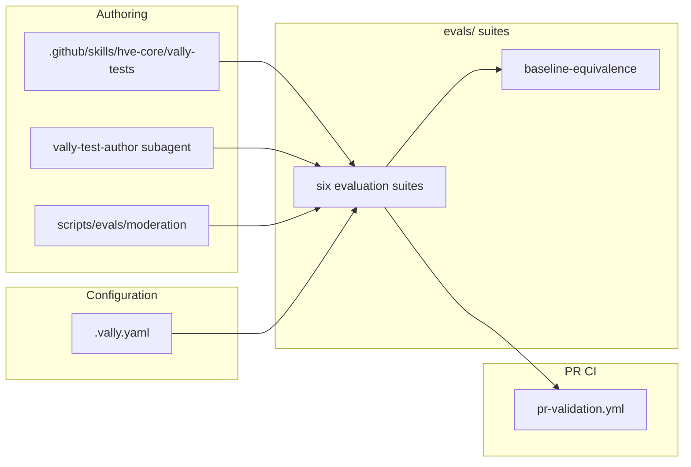

## Context

The hve-core repository ships a large body of AI customization artifacts
(custom agents, prompts, instructions, and skills) that shape Copilot
behavior but carry no compile-time checks. These artifacts are markdown and
YAML, so the toolchain treats them as documents rather than programs: a typo,
a reordered instruction, or a reworded constraint changes runtime agent
behavior while every existing check stays green. Today the only safety net is
markdown and frontmatter linting plus human PR review, neither of which
exercises what an agent actually does when invoked. As the customization
surface grows, the blast radius of a silent behavioral regression grows with
it, and reviewer diligence does not scale to catch divergences across dozens
of interacting artifacts.

The project needed a repeatable way to evaluate the *behavior* of these
artifacts, prove the customization layer does not drift away from the
underlying Copilot baseline beyond documented divergences, and keep test
authoring inside safe content boundaries. This decision is retroactive: it
documents an active changeset that already introduces a Vally-based evaluation
framework spanning roughly 344 files. The changeset adds a multi-suite
`evals/` tree, a root `.vally.yaml` config, a
PowerShell and Python orchestration layer under `scripts/evals/` (including the
content-moderation pipeline at `scripts/evals/moderation/`), a `vally-tests`
authoring skill at `.github/skills/hve-core/vally-tests/`, a
`.github/agents/hve-core/subagents/vally-test-author.agent.md` subagent, a
`.github/agents/content-policy-citation.agent.md` agent, and CI wiring through
changes to `.github/workflows/pr-validation.yml`. How should hve-core standardize
behavioral evaluation of its AI artifacts?

> Source: `.copilot-tracking/adr-plans/agent-evaluation-framework/state.json`, Frame-phase scope, drivers, constraints, and ASR triggers.
> Source: `evals/README.md`, six-suite evaluation architecture.
> Source: `evals/baseline-equivalence/README.md`, baseline-equivalence comparison contract.

## Decision Drivers

* Regression safety
* Baseline-equivalence guarantee
* Authoring consistency
* Tiered enforcement
* Safety boundaries

Each driver maps to a concrete pressure the changeset has to relieve.
Regression safety is the primary one: authored artifacts need a behavioral net
that fails a PR when an edit changes how an agent or skill actually responds,
not merely when the markdown stops linting. Baseline-equivalence guarantee
demands proof that the customization layer still tracks the underlying Copilot
model, surfacing any divergence as an explicit, documented choice rather than
an accident. Authoring consistency requires that writing a new conformance
test follow one repeatable, grader-routed path instead of bespoke per-author
scaffolding. Tiered enforcement separates authoritative gates that must block
merge from advisory, non-deterministic checks that inform but do not fail the
build, so flaky LLM scoring never holds a PR hostage. Safety boundaries keep
generated test corpora inside content-policy and Code of Conduct limits, which
matters because the framework synthesizes adversarial-adjacent stimuli to probe
refusals. The matrix in the next section scores each option against these five
drivers.

## Considered Options

Three options were weighed against the five drivers. They are not equivalent
in kind: Option A is a purpose-built harness for evaluating authored
artifacts, Option B is a runtime behavioral framework aimed at a different
layer of the stack, and Option C is the pre-changeset baseline. The framing
below keeps that distinction explicit so the matrix that follows is read as a
fit-for-purpose comparison rather than a feature bake-off.

* Option A: Adopt Vally (`@microsoft/vally-cli`) with a Copilot-SDK executor and a multi-suite `evals/` tree.
* Option B: Adopt `vyta/beval` for runtime/agentic behavioral evaluation (complementary; integration in progress, not a replacement).
* Option C: No automated behavior evaluation (status quo): markdown/frontmatter linting plus human PR review only.

## Decision Outcome

The matrix scores each option against the five drivers. "Yes" means the option
satisfies the driver directly and as a first-class capability; "Partial" means
it addresses the driver only for a subset of cases or at a different layer; and
"No" means the driver is unmet. Only Option A scores "Yes" across the board for
the authored-artifact problem, which is the result the prose after the matrix
explains.

| Decision driver                | Option A (Vally) | Option B (beval)        | Option C (status quo) |
|--------------------------------|------------------|-------------------------|-----------------------|
| Regression safety              | Yes              | Partial (runtime layer) | No                    |
| Baseline-equivalence guarantee | Yes              | No                      | No                    |
| Authoring consistency          | Yes              | Partial                 | No                    |
| Tiered enforcement             | Yes              | Partial                 | No                    |
| Safety boundaries              | Yes              | Partial                 | No                    |

Chosen option: **"Option A: Adopt Vally (`@microsoft/vally-cli`) with a Copilot-SDK executor and a multi-suite `evals/` tree"**,
because it is the only option that satisfies all five decision drivers for the
authored-artifact evaluation problem. Its Copilot-SDK-native executor evaluates
hve-core agents, prompts, instructions, and skills as actually invoked, its
pairwise `vally compare` provides a first-class baseline-equivalence guarantee,
its tag-routed grader catalog matches the multi-suite design, and it is npm-
and GitHub-Actions-native so it fits existing PR CI and local `npm run`
workflows.

`vyta/beval` (Option B) is complementary rather than rejected: it targets a
different layer (runtime, multi-turn agentic behavior with scored
multi-dimensional metrics and persona-driven conversation simulation over
ACP/A2A) and is being integrated through open pull requests. It does not
provide a pairwise baseline-equivalence comparison and therefore cannot replace
Vally for the customization-artifact regression and baseline-equivalence role.
The two frameworks are intended to coexist at different layers.

The status quo (Option C) was rejected because it leaves AI artifacts without
any regression safety net or baseline protection and makes authoring
consistency depend entirely on reviewer diligence.

### Consequences

Adopting Vally trades a heavier CI footprint and the inherent noise of
non-deterministic evaluation for a regression and baseline-equivalence net the
repository did not previously have. The good outcomes accrue to artifact
authors and reviewers; the bad outcomes land on CI maintenance and runtime
cost; the neutral items reflect deliberate scoping decisions (the beval
coexistence boundary and the data-driven `.vally.yaml` configuration) that are
neither wins nor regressions on their own.

* Good, because it gives non-code AI artifacts a behavioral regression net and a baseline-equivalence proof they previously lacked.
* Good, because the `vally-tests` skill makes conformance authoring repeatable and grader-routed instead of ad hoc.
* Good, because tiered enforcement separates authoritative blocking gates from advisory non-deterministic conformance checks.
* Good, because the framework reuses existing skill-validation, fuzz-harness, and corpus-moderation conventions rather than inventing parallel ones.
* Bad, because it adds a new external dependency (`@microsoft/vally-cli`) plus a Copilot-SDK runtime to CI.
* Bad, because non-deterministic LLM evaluation introduces cost, latency, and flakiness that require multiple runs, tolerant graders, and generous timeouts.
* Bad, because it lands a large, multi-suite eval-infrastructure footprint that becomes ongoing maintenance surface.
* Neutral, because `vyta/beval` remains a complementary runtime/agentic evaluation layer under active integration; the two frameworks coexist at different layers.
* Neutral, because the executor and grader catalog are configured centrally in `.vally.yaml`, so suite behavior is data-driven rather than encoded per test.

### Confirmation

Compliance with this decision is confirmed by the evaluation framework itself
running under `autonomyTier: partial` Govern controls:

1. The evaluation matrix in `.github/workflows/pr-validation.yml` runs the `evals/` suites in PR CI and blocks merge on authoritative-gate failures.
2. The baseline-equivalence suite (`evals/baseline-equivalence/README.md`) asserts that only documented divergences from the Copilot baseline are present.
3. The corpus-moderation pipeline (`scripts/evals/moderation/moderate.py`) gates generated test corpora against the closed refusal taxonomy before use.
4. The `vally-tests` skill provides the repeatable authoring path whose outputs feed the suites above.

These four checks map to the recorded success criteria: a green agent-matrix
run demonstrates regression coverage, a passing `vally compare` demonstrates
baseline equivalence, a clean moderation gate demonstrates that generated
corpora stay inside safety boundaries, and adoption of the skill path
demonstrates authoring consistency. The decision is considered confirmed for a
given release when all four hold in PR CI.

## Pros and Cons of the Options

### Option A: Adopt Vally with a Copilot-SDK executor

Vally is the only candidate built specifically to evaluate authored
customization artifacts as Copilot invokes them, and its pairwise comparison
mode is what makes baseline equivalence a measurable property rather than an
aspiration. Its costs are real but bounded, and they fall on CI rather than on
authors.

* Good, because the Copilot-SDK-native executor evaluates hve-core agents/prompts/instructions/skills as actually invoked.
* Good, because pairwise `vally compare` gives a first-class baseline-equivalence guarantee against the underlying model.
* Good, because tag-based suite routing and a grader catalog match the multi-suite `evals/` design.
* Good, because it is npm- and GitHub-Actions-native, fitting existing PR CI and local `npm run` workflows.
* Neutral, because the grader catalog and executor are configured in `.vally.yaml`, adding one central config surface to learn.
* Bad, because it introduces a new external dependency and a Copilot-SDK runtime in CI.
* Bad, because non-deterministic evals require multiple runs, tolerant graders, and generous timeouts.

### Option B: Adopt vyta/beval for runtime/agentic evaluation

beval is the stronger tool for the problem it targets, namely scoring how a
running agent behaves across a multi-turn conversation, but that is a different
problem from proving an edited instruction file still matches the baseline.
Its current alpha maturity and the absence of a pairwise comparison are why it
supplements rather than replaces Vally here.

> See [github.com/vyta/beval](https://github.com/vyta/beval): a language-agnostic framework for behavioral evaluation of AI agents and LLM systems with a Given/When/Then DSL, scored multi-dimensional metrics, layered graders, and conversation simulation over ACP/A2A.

* Good, because scored multi-dimensional metrics and conversation simulation capture multi-turn/agentic behavior that pass/fail conformance does not.
* Good, because ACP-stdio/A2A adapters evaluate running agents, including a `dt-coach` sample directly relevant to hve-core.
* Good, because it is a language-agnostic spec with cross-language conformance, MIT-licensed, and under active Microsoft development.
* Neutral, because it operates at a different layer than Vally and is intended to coexist with it.
* Bad, because it is experimental/alpha (git-subdirectory install only; APIs and schemas may change).
* Bad, because it has no pairwise baseline-equivalence equivalent to `vally compare`, so it cannot fill the customization-artifact regression role.
* Bad, because its integration is still in progress through open PRs and is not yet a standard PR CI gate.

### Option C: No automated behavior evaluation (status quo)

Keeping the status quo is the cheapest option on day one and the most
expensive over time. It carries no infrastructure cost and no flakiness, but it
leaves every behavioral regression to chance and to reviewer attention, which
is exactly the exposure this changeset exists to close.

* Good, because it adds zero new dependencies, infrastructure, or CI cost.
* Good, because there is no non-determinism or eval flakiness to manage.
* Bad, because AI artifacts can silently drift on edits with no regression safety net.
* Bad, because there is no evidence the customization layer preserves baseline model behavior.
* Bad, because authoring consistency depends entirely on reviewer diligence.

## Architecture

The framework is organized as four cooperating stages. Authoring artifacts (the
`vally-tests` skill and the `vally-test-author` subagent) produce stimulus and
expectation files. Those files, together with the moderation pipeline output,
are gathered into the suite tree under `evals/`. The suite tree drives two
consumers: the baseline-equivalence comparison and the PR CI matrix. CI is
where enforcement happens, with the `pr-validation.yml` workflow running the
evaluation matrix as the merge gate. The diagram below traces that flow from authoring on the
left to enforcement on the right.

## Risks and Mitigations

* Risk: a new external dependency (`@microsoft/vally-cli`) plus a Copilot-SDK runtime in CI increases build complexity and supply-chain surface. Mitigation: pin the dependency, run it through the existing dependency-pinning checks, and isolate the Copilot-SDK runtime to the evaluation matrix workflow.
* Risk: non-deterministic LLM evaluation produces cost, latency, and flaky results. Mitigation: configure multiple runs (`runs: 3+`), tolerant graders, and generous timeouts; avoid pinned models; route non-deterministic checks to the advisory tier.
* Risk: the large multi-suite eval-infrastructure footprint becomes ongoing maintenance surface. Mitigation: keep suite behavior data-driven through `.vally.yaml` and the grader catalog, and reuse existing skill-validation, fuzz-harness, and moderation conventions instead of bespoke tooling.

## Rollback / Exit Strategy

If this decision is reversed, the rollback path is:

1. Remove the `evals/` suite tree, `.vally.yaml`, and the `scripts/evals/` orchestration and moderation layers.
2. Remove the `.github/skills/hve-core/vally-tests/` skill, the `vally-test-author` subagent, and the `content-policy-citation` agent.
3. Revert the `evals/`-related changes in `.github/workflows/pr-validation.yml`.
4. Update any collection manifests that reference the removed skill/agent and re-run `npm run plugin:generate`.
5. Document the reversal in a superseding ADR that links back to this one and sets `superseded-by` here.

No data migration is required: removing the framework leaves the underlying AI customization artifacts untouched.

## Affected Components

* evals/
* .vally.yaml
* scripts/evals/
* scripts/evals/moderation/
* .github/skills/hve-core/vally-tests/
* .github/agents/hve-core/subagents/vally-test-author.agent.md
* .github/agents/content-policy-citation.agent.md
* .github/workflows/pr-validation.yml

## More Information

* Session state: `.copilot-tracking/adr-plans/agent-evaluation-framework/state.json`
* Suite architecture: `evals/README.md` and the `evals/` suite tree
* Central config: `./.vally.yaml`
* Orchestration: `scripts/evals/` (PowerShell and Python)
* Moderation pipeline: `scripts/evals/moderation/`
* Authoring skill: `.github/skills/hve-core/vally-tests/`
* Test-author subagent: `.github/agents/hve-core/subagents/vally-test-author.agent.md`
* Content-policy agent: `.github/agents/content-policy-citation.agent.md`
* PR validation workflow (evaluation matrix gate): `.github/workflows/pr-validation.yml`
* Complementary runtime framework: [vyta/beval](https://github.com/vyta/beval) (language-agnostic agentic behavioral evaluation; integration in progress via open PRs)

This decision should be re-visited if `vyta/beval` integration matures enough to subsume the customization-artifact regression role, if Vally's Copilot-SDK executor or `vally compare` contract changes materially, or if the cost and flakiness of non-deterministic evaluation outweigh the regression-safety benefit.

🤖 Crafted with precision by ✨Copilot following brilliant human instruction, then carefully refined by our team of discerning human reviewers.
